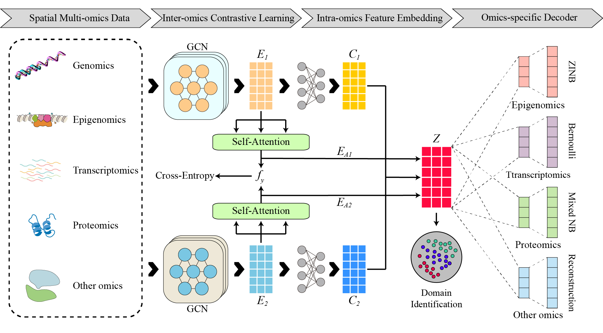

# soFusion: facilitating tissue compartmentalization via spatial multi-omics data fusion

## Introduction  

To address the challenge of delineating tissue compartments by integrating heterogeneous spatial omics data, we present **soFusion**, a unified framework for spatial multi-omics data fusion and representation learning. soFusion is designed to flexibly integrate any two spatial omics modalities, thereby enabling comprehensive spatial compartment identification.

At the core of soFusion, spatially informed Graph Convolutional Networks (GCNs) are employed to extract low-dimensional embeddings from each omics layer, preserving both molecular context and spatial structure. To construct a joint multi-omics representation that captures both shared and modality-specific signals, soFusion incorporates an intra- and inter-omics feature learning strategy, promoting synergistic information exchange across omics. To faithfully recapitulate the unique distributional characteristics of diverse omics layers, soFusion further introduces dedicated decoders: a zero-inflated negative binomial decoder for transcriptomic counts, a Bernoulli decoder for epigenomic profiles, and a dual negative binomial mixture decoder for proteomic data. For additional omics types, a universal decoder based on fully connected networks is provided.

The workflow of soFusion is shown in the following diagram.  



## Installation  
soFusion is implemented using Python 3.7.12 and Pytorch 1.11.0.  

### Requirements  
numpy==1.21.5  
torch==1.11.0  
pandas==1.3.5  
numba==0.55.1  
scanpy==1.9.1  
scikit-learn==1.0.2  
scipy==1.7.3  
anndata==0.8.0  
matplotlib==3.5.2    

### Install soFusion  
```python
git clone https://github.com/sunxue-yy/soFusion.git

cd soFusion

python setup.py build

python setup.py install --user
```

## Datasets    
All datasets used in this study are publicly available. Users can download them from the links below.

  The mouse thymus dataset and human Lymph Node dataset are obtained from https://zenodo.org/records/10362607.   

  The SPOTS mouse spleen dataset is available at GEO with accession code GSE198353.   

  The human tonsil dataset can be accessed at https://doi.org/10.6084/m9.figshare.21623148.v5.   

  The MISAR-seq mouse brain dataset is accessible at the National Genomics Data Center with accession number OEP003285.  

  The spatial ATAC-RNA-seq mouse brain dataset can be found at https://web.atlasxomics.com/visualization/Fan/.  


## Tutorial  

Here, we present two examples to illustrate the application of soFusion for spatial domain identification.   

### Mouse thymus Stereo-CITE-seq dataset  

```python
# Import necessary libraries
import matplotlib.pyplot as plt
from sklearn.metrics.cluster import adjusted_rand_score
from soFusion.utils import *
from soFusion.process import *
from soFusion import train_model
from datetime import datetime
import anndata

# Load ADT and RNA data
adata1=anndata.read("Data/Mouse_Thymus/adata_ADT.h5ad")  # Load ADT data
adata2=anndata.read("Data/Mouse_Thymus/adata_RNA.h5ad")  # Load RNA data

# Preprocess ADT data
prefilter_genes(adata1, min_cells=3)  # Filter genes expressed in at least 3 cells
sc.pp.normalize_per_cell(adata1)      # Normalize data per cell
sc.pp.log1p(adata1)                   # Log transform the data

# Preprocess RNA data
prefilter_genes(adata2, min_cells=3)  # Filter genes expressed in at least 3 cells
sc.pp.highly_variable_genes(adata2, flavor="seurat_v3", n_top_genes=3000)  # Select top 3000 variable genes
sc.pp.normalize_per_cell(adata2)      # Normalize data per cell
sc.pp.log1p(adata2)                   # Log transform the data

# Calculate spatial adjacency matrix and prepare data for training
adj = calculate_adj_matrix(adata1,"x","y")  # Calculate spatial adjacency matrix using x,y coordinates
adatalist = [adata1,adata2]                 # Combine datasets into a list
sequencing = ["ADT","RNA"]                  # Specify sequencing types

# Train the soFusion model
adata1, adata2= train_model.train(adatalist,adj,sequencing, k=10,n_epochs=50,h=[3000,3000],device='cpu')

# Visualize results
sc.pl.spatial(adata1, spot_size=100,color='soFusion',save="soFusion")  # Plot spatial visualization
sc.pp.neighbors(adata1, use_rep='emb_pca')                             # Compute neighborhood graph
sc.tl.umap(adata1)                                                     # Compute UMAP embedding
plt.rcParams["figure.figsize"] = (3, 3)                                # Set figure size
sc.pl.umap(adata1, color="soFusion", title='soFusion',save="soFusion_umap")  # Plot UMAP visualization
```

### MISAR-seq mouse brain dataset

```python
# Import necessary libraries
import matplotlib.pyplot as plt
from sklearn.metrics.cluster import adjusted_rand_score
from soFusion.utils import *
from soFusion.process import *
from soFusion import train_model
from datetime import datetime
import anndata

# Load ATAC-seq and RNA-seq data for E15 mouse embryonic brain
adata1=anndata.read("Data/Mouse_embryonic_brain/E15/E15_adata_atac.h5ad")  # Load ATAC-seq data
adata2=anndata.read("Data/Mouse_embryonic_brain/E15/E15_adata_rna.h5ad")   # Load RNA-seq data

# Add cluster annotations as ground truth labels
adata1.obs['Y'] = adata1.obs['Combined_Clusters_annotation'].astype(str)
adata2.obs['Y'] = adata1.obs['Combined_Clusters_annotation'].astype(str)

# Process spatial coordinates
spatial_coords = np.column_stack((adata1.obs["array_col"], adata1.obs["array_row"]))
adata1.obsm['spatial'] = spatial_coords  # Add spatial coordinates to ATAC data
adata2.obsm['spatial'] = spatial_coords  # Add spatial coordinates to RNA data

# Convert spatial coordinates to pixel coordinates
coor = pd.DataFrame(adata1.obsm['spatial'])
coor.index = adata1.obs.index
coor.columns = ['imagerow', 'imagecol']
adata1.obs["y_pixel"]=coor['imagerow']  # Add y-pixel coordinates
adata1.obs["x_pixel"]=coor['imagecol']  # Add x-pixel coordinates

# Preprocess ATAC-seq data
adata1.X = adata1.X.astype(float)  # Convert data to float type
prefilter_genes(adata1, min_cells=3)  # Filter genes expressed in at least 3 cells
sc.pp.highly_variable_genes(adata1, flavor="seurat_v3", n_top_genes=8000)  # Select top 8000 variable genes
sc.pp.normalize_per_cell(adata1)  # Normalize data per cell
sc.pp.log1p(adata1)  # Log transform the data

# Preprocess RNA-seq data
prefilter_genes(adata2, min_cells=3)  # Filter genes expressed in at least 3 cells
sc.pp.normalize_per_cell(adata2)  # Normalize data per cell
sc.pp.log1p(adata2)  # Log transform the data
sc.pp.highly_variable_genes(adata2, flavor="seurat_v3", n_top_genes=3000)  # Select top 3000 variable genes

# Prepare data for model training
adj = calculate_adj_matrix(adata1,"array_col","array_row")  # Calculate spatial adjacency matrix
adatalist = [adata1,adata2]  # Combine datasets into a list
sequencing = ["ATAC","RNA"]  # Specify sequencing types

# Train the soFusion model
adata1, adata2= train_model.train(adatalist,adj,sequencing, k=14,n_epochs=20,h=[3000,3000],l=0.5,device='cpu')

# Calculate and print Adjusted Rand Index (ARI) for clustering evaluation
obs_df = adata1.obs.dropna()
ARI0 = adjusted_rand_score(obs_df['soFusion'], obs_df['Y'])
print('Adjusted rand index = %.2f' % ARI0)

# Visualize results
sc.pl.spatial(adata1, spot_size=1,color='soFusion',title='soFusion {}'.format(ARI0),save="E_soFusion")  # Plot spatial visualization
sc.pp.neighbors(adata1, use_rep='emb_pca')  # Compute neighborhood graph
sc.tl.umap(adata1)  # Compute UMAP embedding
plt.rcParams["figure.figsize"] = (3, 4)  # Set figure size
sc.pl.umap(adata1, color="soFusion", title='soFusion',save="E_soFusion_umap")  # Plot UMAP visualization
```
